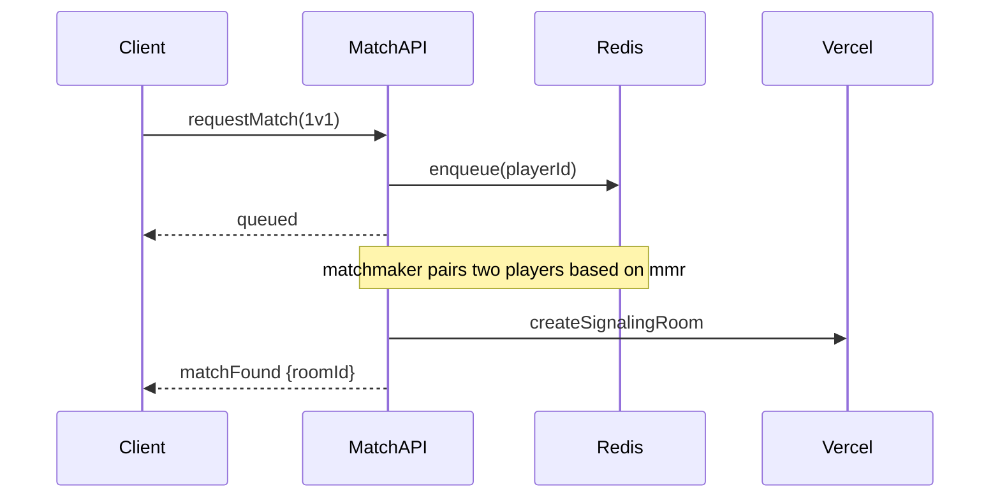
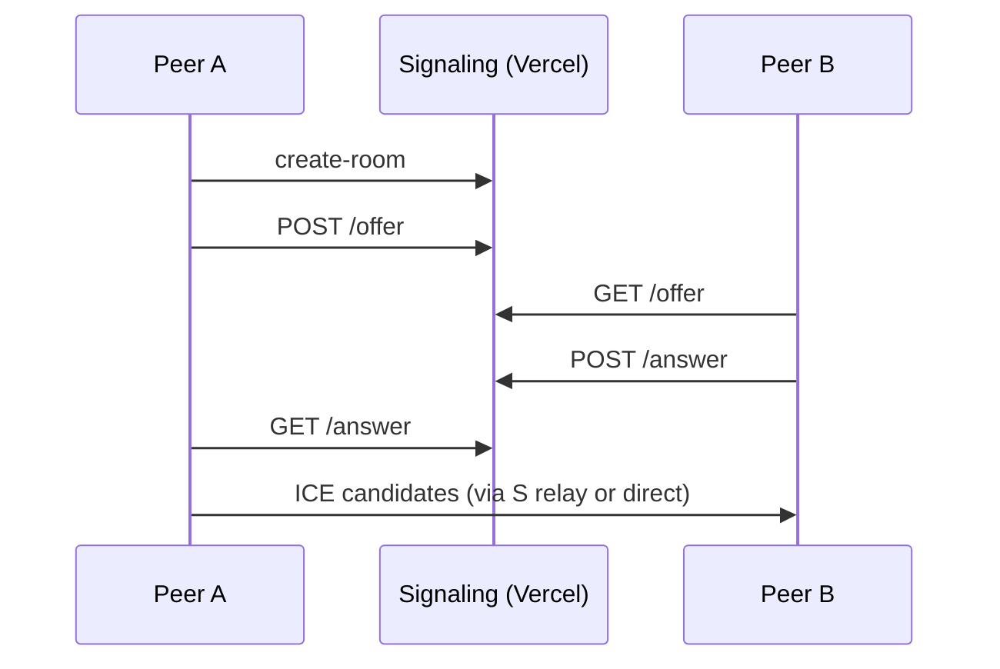
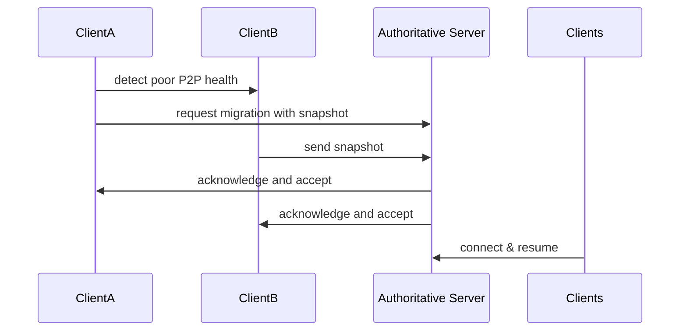

# Architecture Specification — 1v1-inspired Browser Game

This document describes the production-ready architecture for the browser game. It maps to project TODOs and provides implementation milestones, acceptance criteria, and KPIs.

## Overview

- Frontend: Next.js (TypeScript, React) deployed to Vercel.
- Rendering: Canvas2D primary, optional WebGL/Three.js renderer.
- Networking: WebRTC datachannels P2P for 1v1 with Vercel serverless signaling; optional authoritative server (Colyseus).
- Persistence: Postgres for relational data, Redis for ephemeral/state and leaderboards caching, CDN for static assets.

## High-level system diagram

```mermaid
graph LR
  Client[Client (Next.js + Game Engine)]
  CDN[CDN (Assets)]
  Vercel[Serverless Signaling API\n(Vercel Functions)]
  Auth[Auth Provider\n(Email / OAuth)]
  DB[(Postgres)]
  Redis[(Redis)]
  AuthServer[Auth Service \n(Next.js API / Auth0)]
  AuthServer --> DB
  Vercel --> AuthServer
  Client --> CDN
  Client --> Vercel
  Client -->|P2P WebRTC| Client2[Client (peer)]
  Client -->|Optional| Authoritative[Authoritative Realtime Server\n(Colyseus / Socket.io)]
  Authoritative --> DB
  Authoritative --> Redis
```

## Component breakdown

### Frontend app structure (Next.js, TypeScript)

- pages/
  - /index.tsx - landing + matchmaking UI
  - /play/[room].tsx - game page (canvas mount, renderer selection)
- src/
  - engine/ - core game engine modules
    - renderer/ - Canvas2D + optional WebGL renderer adapter
    - physics/ - deterministic physics module (fixed timestep)
    - input/ - input sampling & command buffering
    - ecs/ - entity-component system and network serialization
    - net/ - networking client (WebRTC/Colyseus adapters)
  - ui/ - HUD, menus, lobby
  - api/ - client-side API wrappers (auth, match history, leaderboards)

### Game engine modules

- Rendering: Canvas2D renderer with a RendererAdapter interface to swap in Three.js/WebGL renderer. Keep draw calls batched and minimize state changes.

- Physics: Deterministic fixed-timestep simulation (tick = 20ms by default -> 50Hz; adjustable to 30–60Hz). Use integer-based or quantized state to avoid floating-point divergence.

- Input: Collect raw inputs per frame, translate to compact command structures (timestamp, seq, actions) and queue for local prediction and network send.

- ECS: Lightweight entity/component system with deterministic update ordering. Components include Transform, PhysicsBody, PlayerState, WeaponState, Buildable.

### Networking layer

- Abstract network adapter interface supporting:
  - P2P via WebRTC DataChannel
  - Authoritative via WebSocket/Colyseus

- Transport-agnostic message formats and serializers (binary protobuf or packed JSON with zlib).

### Authentication & Persistence APIs

- Auth: Email verification + OAuth providers (Google/GitHub). JWT short-lived access tokens and refresh tokens stored via secure HTTP-only cookies.

- Persistence APIs (Vercel serverless functions): endpoints for match recording, leaderboards write/read, profile updates. Serverless functions sign and validate incoming requests.

## Deterministic networking design

- Tick rate: Default authoritative tick 50Hz (20ms). For P2P, tick sync and input exchange at 20–50Hz depending on latency.

- Trade-offs:
  - Authoritative server: single source of truth, easier anti-cheat, higher cost and latency.
  - Lockstep/P2P: lower latency for 1v1, cheaper, but more sensitive to desync and NAT issues.

- State shape & snapshot format (machine-readable JSON/CBOR example):

```json
{
  "tick": 102345,
  "entities": [
    {"id":123,"pos":[1024,512],"vel":[0,0],"hp":85,"flags":3},
    {"id":124,"pos":[980,540],"vel":[-1,0],"hp":100,"flags":1}
  ]
}
```

- Command input model (compact JSON):

```json
{"playerId":"u-abc","tick":102345,"seq":5012,"inputs":[{"type":"move","dir":[1,0]},{"type":"shoot","aim":[0.7,0.3]}]}
```

- Rollback / reconciliation:
  - Clients simulate locally on input; on receiving authoritative snapshot or peer input, perform differential rollback: restore state at snapshot tick, reapply stored inputs up to current tick, reconcile divergent entities by interpolation and small corrective impulses to avoid pop.

- Client-side prediction:
  - Predict movement and immediate shooting; local visual-only effects are shown immediately. Maintain command buffer with seq numbers for reconciliation.

- Interpolation strategy:
  - Render interpolation uses buffered snapshots at renderTick = serverTick - interpolationDelay (e.g., 2 ticks). For P2P, maintain symmetrical buffering; in low-latency, use 1-tick interpolation.

- Bandwidth optimizations:
  - Delta compression: send only changed entity fields (pos delta + compressed quantization).
  - Snapshot packing: binary encoding (CBOR/protobuf), bit-packing for small integers.
  - Prioritize vital entities (players, bullets) and use LOD for other entities.

## WebRTC signaling API design (Vercel serverless)

- Endpoints (REST JSON):
  - POST /api/signaling/create-room -> {roomId, offerId} — create room and store ephemeral metadata (Redis)
  - POST /api/signaling/offer -> {roomId, sdp, clientId}
  - POST /api/signaling/answer -> {roomId, sdp, clientId}
  - POST /api/signaling/candidate -> {roomId, candidate, clientId}
  - POST /api/signaling/close -> {roomId, clientId}

- Message formats (example):

```json
{"type":"offer","sdp":"v=0...","clientId":"u-123","roomId":"r-456"}
```

- Handshake flow:
  1. Caller creates room via create-room; server reserves room metadata in Redis with TTL.
  2. Caller POSTs offer to /offer; server persists offer and notifies callee via polling or push (if using server-sent events).
  3. Callee fetches offer, creates answer, POSTs to /answer.
  4. Both peers exchange ICE candidates via /candidate until connectivity established.

- NAT traversal notes:
  - Use STUN servers (public) and optional TURN for relay fallback when direct P2P fails; include TURN credentials in signaling response when allocated.

- Error handling & reconnect:
  - Signaling responses include status codes and retry-after. On transient failure, client retries with exponential backoff; on permanent failure, fall back to authoritative server mode.

## Authoritative server API contract (Colyseus-style)

- Room lifecycle:
  - createRoom(matchConfig) -> roomId
  - joinRoom(roomId, clientToken) -> joinAck
  - leaveRoom(roomId, clientId)
  - closeRoom(roomId)

- Message schemas (example JSON over WebSocket):

```json
{"type":"input","playerId":"u-1","tick":102345,"seq":5012,"inputs":[...]}
{"type":"snapshot","tick":102345,"state":{...}}
{"type":"event","eventType":"player_death","payload":{"id":123,"by":456}}
```

- Server-side validation rules:
  - Validate input ranges (velocity, position deltas)
  - Check action cooldowns and rate limits
  - Authoritative resolution of collisions and damage

- Cheat mitigation entry points:
  - Server verifies client-reported deltas against plausible physics, rejects impossible teleport jumps, enforces per-action rate limits, and flags suspicious clients for review.

## Fallback strategy (P2P <-> Authoritative)

- Exact conditions to switch:
  - If WebRTC connection fails to establish after N_attempts or RTT median > 250ms or packet loss > 15% for 5s, trigger fallback.
  - If anti-cheat confidence low (e.g., detected tampering), migrate to authoritative.

- Migration algorithm:
  1. Initiator (client or server) signals migration intent to peers and authoritative server.
  2. Freeze inputs for next tick, exchange last confirmed snapshot and input buffers.
  3. Authoritative server initializes room with the provided snapshot and input history, validates and resumes simulation.
  4. Clients reconnect to authoritative server and resume with minimal disruption (show "migrating" UI).

- Mid-match migrations:
  - Must be atomic at a tick boundary. If migration fails, roll back to pre-migration snapshot and retry or forfeit match.

## Matchmaking, lobby, private-room flows

- Matchmaking flow (sequence):



- State transitions: idle -> searching -> matched -> connecting -> in-match -> post-match

## Data models and schemas

- Players (Postgres):

```sql
CREATE TABLE players (
  id UUID PRIMARY KEY,
  username TEXT UNIQUE NOT NULL,
  email TEXT UNIQUE,
  salt TEXT,
  hash TEXT,
  created_at TIMESTAMP DEFAULT now()
);
```

- Matches (Postgres):

```sql
CREATE TABLE matches (
  id UUID PRIMARY KEY,
  created_at TIMESTAMP DEFAULT now(),
  mode TEXT,
  duration_ms INTEGER,
  winner UUID REFERENCES players(id),
  raw_snapshot JSONB
);
```

- Leaderboard (Redis + Postgres backup) example JSON:

```json
{"playerId":"u-123","rank":42,"score":12345}
```

## Auth flow

- Email verification:
  - POST /api/auth/signup -> sends verification email with signed token (expires 24h).
  - GET /api/auth/verify?token= -> marks email verified.

- OAuth:
  - Use OAuth flow redirect through provider; on callback, create or map user, issue JWT.

- Tokens & sessions:
  - Access token: JWT (~5m).
  - Refresh token: long-lived, HTTP-only secure cookie.
  - Rotate refresh tokens on use. Store revocation list in Redis.

- Secrets management:
  - Store secrets in Vercel environment variables or recommended secret manager; rotate quarterly and on compromise.

## CI/CD & deployment

- Vercel for frontend and serverless signaling functions.
- GitHub Actions pipeline:
  - PR: run unit tests, lint, build.
  - Main: build & deploy to Vercel, run integration tests.

- Authoritative server self-hosting:
  - Provide docker-compose and Helm charts. Service exposes WebSocket port, connects to Postgres and Redis.

## Testing strategy

- Unit tests: physics, ecs, serialization.
- Integration: network adapter and signaling mocks.
- Network simulation tests: run headless clients with simulated latency/loss to verify determinism and reconciliation.
- E2E: Playflows using Playwright for lobby and match join; use headless game clients for simulated matches.
- Profiling: use Chrome DevTools, Flamegraphs (0x/node), and wasm profiler if using WASM modules.

## Performance budgets & telemetry

- Targets:
  - 60 FPS on desktop (budget 16ms/frame render + 4ms physics).
  - Median latency <100ms for P2P 1v1 on test infra.
  - Network: <10KB/s per player idle, <100KB/s during combat (with compression).

- Telemetry:
  - FPS, frame time distribution, CPU, memory, tick drift, RTT, packet loss, serialized snapshot sizes.

## Security & anti-cheat

- Server-side canonical validation of physics-critical events.
- Rate-limiting signaling endpoints and authoritative RPCs.
- Tamper resistance:
  - Signed payloads for sensitive client-side logs, integrity checksums for assets.
- Secrets rotation and limited scope tokens.

## Scaling & observability

- Observe: concurrent matches, signaling RPS, authoritative room counts, Redis memory, DB connections.
- Alerts: signaling errors >1% for 5m, median RTC connect time >5s, authoritative server CPU >75% sustained.

## Example message schemas (machine-readable)

- Snapshot (CBOR/protobuf recommended; JSON example):

```json
{
  "type":"snapshot",
  "tick":102345,
  "players":[{"id":"u-1","x":1024,"y":512,"vx":0,"vy":0,"hp":90}]
}
```

- Input command:

```json
{"type":"input","playerId":"u-1","tick":102345,"seq":5012,"cmd":{"move":[1,0],"shoot":true,"aim":[0.7,0.3]}}
```

## Sequence diagrams (critical flows)

- P2P handshake:



- Fallback migration:



## Prioritized implementation plan and milestones

Short term (0–4 weeks)

1. Core engine scaffolding (ECS, fixed-step physics, renderer adapter) — TODO: implement engine scaffold. Est: 2w
2. Local input + command buffer, deterministic simulation tests — TODO: deterministic-tests. Est: 1w
3. WebRTC signaling API (Vercel) + minimal client signaling flow — TODO: signaling-api. Est: 1w

Medium term (1–3 months)

4. P2P match flow for 1v1 with client-side prediction & reconciliation — TODO: p2p-1v1. Est: 3w
5. Matchmaking + lobby UI + private rooms — TODO: matchmaking-lobby. Est: 3w
6. Persistent storage schemas + APIs (Postgres + Redis) — TODO: persistence-api. Est: 2w

Long term (3–6 months)

7. Optional authoritative server (Colyseus) + migration/fallback logic — TODO: authoritative-server. Est: 4w
8. Auth (email + OAuth), leaderboards, match history — TODO: auth-leaderboards. Est: 3w
9. Tests, CI/CD, profiling and observability — TODO: testing-ci. Est: 3w

## Acceptance criteria & KPIs

- Deterministic physics: headless simulation runs 1,000 matches with 0 desyncs across environments (CI).
- P2P 1v1: median RTT <100ms on test infra, successful connect rate >95%.
- Migration: mid-match migration succeeds within 3s and state divergence <1% entities corrected.
- Performance: stable 60 FPS on target desktop; render+physics within 16ms per frame 95% of the time.

## Appendices

- Recommended tech choices:
  - DB: Postgres for relational, Redis for ephemeral.
  - Serialization: protobuf or CBOR for binary snapshots.
  - TURN: coturn (self-hosted) or Twilio/Agora for managed TURN.

- Glossary: tick, snapshot, seq, reconciliation, authoritative

-- End of document