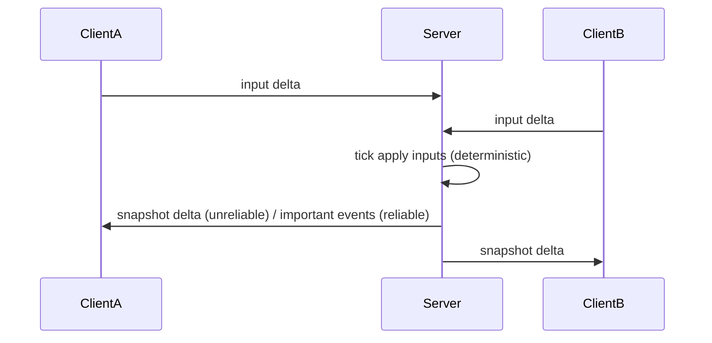

# Realtime engine and networking design

References:
- [`engine/src/sim/tick.ts`](engine/src/sim/tick.ts:1)
- [`engine/src/state.ts`](engine/src/state.ts:1)
- [`networking/src/protocol.ts`](networking/src/protocol.ts:1)
- [`docs/architecture.md`](docs/architecture.md:1)

## Deliverables included in this file
- Design and rationale for authoritative tick loop and networking
- TypeScript interface definitions compatible with [`networking/src/protocol.ts`](networking/src/protocol.ts:1)
- Pseudocode for server tick loop and client prediction/reconciliation
- Mapping to existing code in [`engine/src/state.ts`](engine/src/state.ts:1) and [`engine/src/sim/tick.ts`](engine/src/sim/tick.ts:1)
- Test plan and acceptance criteria

## 1 Authoritative server model and tick loop
- Model: authoritative server is single source of truth. Clients send input messages; server applies deterministically and emits snapshots/deltas.
- Tick rate: configurable; default 20 Hz in current code (`World` uses tickRate=20). Recommend 50 Hz for production; keep configuration option in [`engine/src/sim/tick.ts`](engine/src/sim/tick.ts:1).
- Determinism rules:
  - Fixed-step integration with dt = 1 / tickRate (already present in [`World` ctor`](engine/src/sim/tick.ts:1)).
  - No use of non-deterministic calls (Date.now, Math.random) inside simulation. Introduce a seedable PRNG stored in State.
  - All entity iteration/orderings must be canonical (sort by id when serializing/hashing).
- Handling non-determinism:
  - Compute a canonical state checksum each tick (quantized fields, deterministic order) and include in snapshots or logs.
  - If checksum mismatch detected between authoritative server runs or in tests, persist full snapshot for investigation.

Mermaid flow (high level)


### Tick loop responsibilities (authoritative server)
- Collect inputs for tick N from clients (merge deterministically)
- Apply inputs to state (applyInputsShallow behavior in [`engine/src/state.ts`](engine/src/state.ts:1))
- Run physics, collisions, spawns, despawns (see pseudocode)
- Advance RNG state
- Compute and store state hash
- Emit snapshot or delta to clients

## 2 Deterministic physics approach
- Use fixed-step integration dt = 1 / tickRate (already in code)
- Seedable RNG: add RNG state to State, advance once per tick (e.g., state.rng = xorshift(state.rng))
- Quantize for network/hash: when serializing or hashing, quantize floats to fixed-point integers (e.g., q = Math.round(value * 1000))
- State hashing: hash sorted serialized entity arrays using a fast, stable hash (implement in JS)
- Avoid branching on floating tolerance: explicit collision resolution must be deterministic (current AABB resolve is deterministic)

## 3 Entity / component data model
- Extend existing Entity shape in [`engine/src/state.ts`](engine/src/state.ts:1). Canonical fields:
  - id:string, type:string, x,y: number, vx,vy:number, w,h:number, hp:number, owner?:string, lifetime?:number
- Additional authoritative fields:
  - stateFlags?: number (bitmask)
  - lastInputSeq?: number (players)
  - durability?: number (building_piece)
  - itemType?: string, amount?: number, collected?: boolean (loot)
- Canonical entity types:
  - player, projectile, building_piece, loot
- Compact network representation:
  - EntityStateCompact array entry: [id, typeCode, qx, qy, qvx, qvy, hp, extras?]
  - typeCode map: 1=player,2=projectile,3=building,4=loot

## 4 Network protocol messages
Goals:
- Keep compatibility with existing [`networking/src/protocol.ts`](networking/src/protocol.ts:1)
- Distinguish reliable vs unreliable:
  - Unreliable: input messages, snapshots, deltas (sent via unreliable datachannel)
  - Reliable: spawn/despawn, authoritative events, reconnection handshake (sent via reliable channel or application-level ACKs)

### Message types (high level)
- input: client -> server: batched InputAction[] (unreliable)
- snapshot: server -> client: full snapshot (unreliable, periodic)
- delta: server -> client: tick-to-tick diffs (unreliable)
- spawn/despawn/event: server -> client: reliable
- control: hello, ack, request_snapshot, snapshot_response (reliable)

### TypeScript interfaces
```typescript
// Protocol interfaces compatible with networking/src/protocol.ts
export type Tick = number;
export type ClientId = string;
export type Seq = number;
export type Vec2 = [number, number];

export interface InputAction {
  seq: Seq;
  tick: Tick;
  move?: Vec2;
  shoot?: 1 | 0;
  aim?: Vec2;
}

export interface MsgInput {
  type: "input";
  clientId: ClientId;
  actions: InputAction[];
}

export type TypeCode = 1 | 2 | 3 | 4; // player, projectile, building, loot

export interface EntityStateCompact {
  id: string;
  t: TypeCode;
  qx: number;
  qy: number;
  qvx: number;
  qvy: number;
  hp: number;
  extra?: any;
}

export interface MsgSnapshot {
  type: "snapshot";
  tick: Tick;
  entities: EntityStateCompact[];
  baseTick?: Tick | null;
  checksum?: string;
}

export interface MsgDelta {
  type: "delta";
  tick: Tick;
  changes: EntityStateCompact[];
  removed?: string[];
}

export interface MsgReliableSpawn {
  type: "spawn";
  entity: EntityStateCompact;
}
export interface MsgReliableDespawn {
  type: "despawn";
  id: string;
}
export interface MsgReliableEvent {
  type: "event";
  name: string;
  payload: any;
}

export interface MsgHello {
  type: "hello";
  clientId: ClientId;
  lastAckTick?: Tick;
}
export interface MsgRequestSnapshot {
  type: "request_snapshot";
  fromTick: Tick;
}
export interface MsgSnapshotResponse {
  type: "snapshot_response";
  tick: Tick;
  snapshot: MsgSnapshot;
}

export type Envelope =
  | MsgInput
  | MsgSnapshot
  | MsgDelta
  | MsgReliableSpawn
  | MsgReliableDespawn
  | MsgReliableEvent
  | MsgHello
  | MsgRequestSnapshot
  | MsgSnapshotResponse;

// JSON helpers
export function encodeMessage(msg: Envelope): string {
  return JSON.stringify(msg);
}
export function decodeMessage(s: string): Envelope {
  return JSON.parse(s) as Envelope;
}
```

## 5 Client-side prediction and reconciliation
- Clients maintain local authoritative-synced buffer:
  - input buffer: ordered by seq
  - pendingSnapshots: last authoritative snapshot tick and client confirmed tick
- Workflow:
  1. Sample input at client frame, append InputAction with seq and target tick, apply locally for immediate response (prediction).
  2. Send InputAction to server (unreliable).
  3. When server snapshot arrives for tick T with authoritative state and lastAppliedSeq for this client, client compares server position of its player to predicted state at T.
  4. If divergence > threshold, restore server state at T, reapply buffered inputs with applyInputsShallow up to current tick (rollback + replay), adjust positions smoothly (snap/interpolate).
- Interpolation/extrapolation:
  - Keep renderDelay = 2 ticks (configurable). Render using snapshots at serverTick - renderDelay and interpolate between snapshots.
  - For missing snapshots, extrapolate using velocity for up to N ticks (e.g., 3).

### Reconciliation pseudocode (client)
```typescript
// client-side reconciliation
function onServerSnapshot(snapshot: MsgSnapshot) {
  const serverTick = snapshot.tick;
  // replace authoritative state for entities from snapshot
  state = deserializeSnapshot(JSON.stringify(snapshotToState(snapshot)));
  // find all inputs with tick > serverTick
  const pending = inputsBuffer.filter(inp => inp.tick > serverTick);
  for (const inpMap of pending) {
    state = applyInputsShallow(state, inpMap, 1 / tickRate);
  }
  // update client predicted state
  applyVisualCorrection(state);
}
```

## 6 Server tick loop pseudocode and mapping
- Map to [`engine/src/sim/tick.ts`](engine/src/sim/tick.ts:1): current `World.tick` merges inputs, calls `applyInputsShallow`, handles bullets and collisions and sets `this.state = next`.
- Suggested pseudocode shows where to add RNG, hashing, snapshot emission and reconnection hooks.

```text
// pseudocode for World.tick (authoritative)
function worldTick(inputMaps[]) {
  // 1. merge inputs deterministically (preserve key order)
  merged = mergeInputs(inputMaps)
  // 2. apply inputs shallow (movement + bullets)
  next = applyInputsShallow(state, merged, dt)
  // 3. spawn bullets from inputs (as current code)
  // 4. collision detection and resolution (current code)
  // 5. advance RNG: state.rng = rng_next(state.rng)
  // 6. compute quantized snapshot + checksum
  checksum = computeChecksum(next)
  // 7. attach checksum to next (for logging)
  next.lastChecksum = checksum
  // 8. emit delta or snapshot to clients
  emitSnapshotOrDelta(next, checksum)
  // 9. set authoritative state
  state = next
}
```

### Changes mapping
- Add to [`engine/src/state.ts`](engine/src/state.ts:1):
  - extend `State` type with `rng: number` and `lastChecksum?: string`
  - export quantize/serialize helpers and `computeChecksum`
- Update [`engine/src/sim/tick.ts`](engine/src/sim/tick.ts:1):
  - after finalize section (before `this.state = next`) compute checksum and call network emit hook (abstract)
  - keep `mergeInputs` deterministic

## 7 Snapshot & delta encoding
- Use full snapshots intermittently (e.g., every 20 ticks) and deltas for intermediate ticks.
- Delta encoding: include only changed entity entries and removed ids.
- Quantize positions/velocities to fixed-point ints for transmission.
- Compress batches (CBOR or zlib) optional; keep JSON for development as in [`networking/src/protocol.ts`](networking/src/protocol.ts:1).
- Include checksum in snapshot for determinism checks.

## 8 Tick synchronization
- Clients tag inputs with target tick and seq. Server accepts late inputs within a small grace window (e.g., allow inputs targeted up to current tick; reject inputs older than currentTick - 2).
- Jitter buffer: server processes inputs per tick using input aggregation window; clients maintain send pacing and jitter smoothing.
- Lost packets: clients re-send unacked inputs until acknowledged or tick passed.
- Late inputs: server can apply late inputs for a small window by re-simulating last N ticks (costly) or drop them and rely on predicted correction; prefer small grace window to avoid rollback on server.

## 9 Testing strategy for determinism and networking
- Determinism tests:
  - Unit test: deterministic run with fixed seed and fixed input sequences produce identical state hashes across runs.
  - Fuzz tests: random input sequences with seeded RNG produce same hash across multiple runs.
  - Cross-run state hash checks: run on CI across different Node versions to detect drift.
- Network correctness tests:
  - Simulated latency and packet loss harness that spins up headless clients sending inputs with configured RTT and loss to validate reconciliation and no crash.
  - Integration test: two headless clients P2P with signaling, compare server snapshots to client reconstructed states.
- Example test commands (place in engine/tests):
  - npm run test -- engine/tests/tick.test.ts (add determinism scenarios)
  - add engine/tests/network_sim.test.ts to simulate latency/loss

## 10 Acceptance criteria and mapping to repo
- Implementable against existing shapes:
  - State extensions declared in [`engine/src/state.ts`](engine/src/state.ts:1)
  - Tick loop hooks in [`engine/src/sim/tick.ts`](engine/src/sim/tick.ts:1)
- Explicit mapping:
  - Add `State.rng:number` and `State.lastChecksum?:string` to [`engine/src/state.ts`](engine/src/state.ts:1)
  - In `World.tick` in [`engine/src/sim/tick.ts`](engine/src/sim/tick.ts:1) after collision resolution insert:
    - advance RNG
    - compute checksum using quantized `serializeSnapshot`
    - emit snapshot/delta via transport hook
- Test plan:
  - Add tests in `engine/tests/tick.test.ts` and `engine/tests/determinism.test.ts`
  - CI: run deterministic test with --repeat=5 and fail on mismatch

## 11 Files to add in implementation phase
- `docs/realtime-design.md` (this file)
- `src/network/protocol.interfaces.ts` (TypeScript interfaces for runtime)
- `engine/src/determinism.ts` (hashing and PRNG helpers)
- `engine/tests/determinism.test.ts` and `engine/tests/network_sim.test.ts`

## 12 Short developer notes / next steps
- Keep math in simulation floats for speed, but quantize for network and hashing.
- Implement PRNG and checksum early; it makes debugging desyncs much easier.
- For P2P mode use symmetric buffering and include periodic watermarking of lastAppliedTick for reconnection migration.

-- End of file